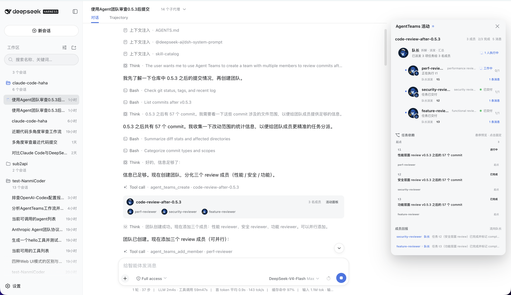

# dsh-agent-teams

DeepSeek Harness 的 AgentTeams 插件：安装后，任何会话只需一句自然语言（例如"用 AgentTeams 调研一下 XX"），即可驱动一个**多智能体团队**协作完成目标，并在 Web GUI 右上角实时看到团队活动面板。

核心语义移植自 Claude Code 的 AgentTeams：**创建团队**（队长 = 当前会话 agent）→ **拉成员**（可续聊子代理）→ **拆任务并声明依赖** → **成员间直接收发消息**（邮箱直达 + 唤醒，无队长中转）。

## 界面预览



## 安装

### 前置要求

- Node.js `^22.19` 或 `>=24`；pnpm 11
- 已安装或可通过 `npx` 使用 DeepSeek Harness

```sh
npx -p @deepseek-ai/dsh dsh plugin --profile web add github:NanmiCoder/dsh-agent-teams
```

该命令直接从 GitHub 仓库安装插件，无需 npm 包。`dsh plugin` 会把插件加入 `web` profile，并根据包内的 `dsh.bundle` 声明自动启用它；工具、系统提示和 Web 客户端入口随该 profile 一起加载。

> **重启生效**：安装完成后，重启正在运行的 DeepSeek Harness Web 服务并刷新页面。

## 使用

安装并重启后，直接对助手说：

> 用 AgentTeams 帮我调研一下开源 RAG 框架的选型，输出对比报告

插件内置提示段会指导模型按协议执行：建团队 → 按角色拉成员 → 拆任务声明依赖 → 领取并唤醒成员 → 轮询收集产出 → 汇报后删除（归档保留）。

## 开发 Skill

仓库按开放 Agent Skills 规范提供 [`dsh-plugin-development`](skills/dsh-plugin-development/SKILL.md)，可直接安装：

```sh
npx skills add NanmiCoder/dsh-agent-teams --skill dsh-plugin-development
```

`skills/dsh-plugin-development/` 是唯一权威源码；`.dsh/skills/` 保存供 DSH 在本仓库作为 cwd 时自动发现的跨平台镜像。修改 Skill 后运行 `pnpm sync:skill`，`pnpm verify` 会检查镜像没有漂移。

## 文档

| 文档 | 内容 |
|---|---|
| [docs/usage.md](docs/usage.md) | 工作原理、Web UI 行为、工具一览、配置、已知限制、验证 |
| [docs/verification-guide.md](docs/verification-guide.md) | 四层验证方法（离线 / 组合 / 真实 e2e / ego-browser GUI） |
| [skills/dsh-plugin-development/SKILL.md](skills/dsh-plugin-development/SKILL.md) | 可通过 `npx skills` 安装的 DSH 插件开发 Skill |
| [docs/developing-dsh-plugins.md](docs/developing-dsh-plugins.md) | 面向人类阅读的开发指南（本插件为样例） |

## License

MIT
